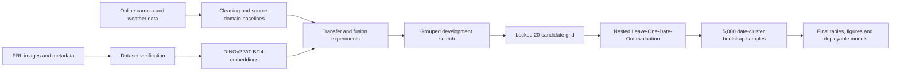
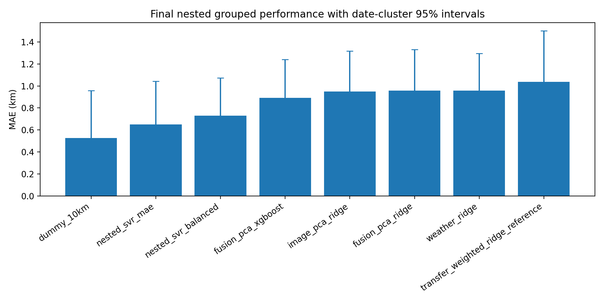
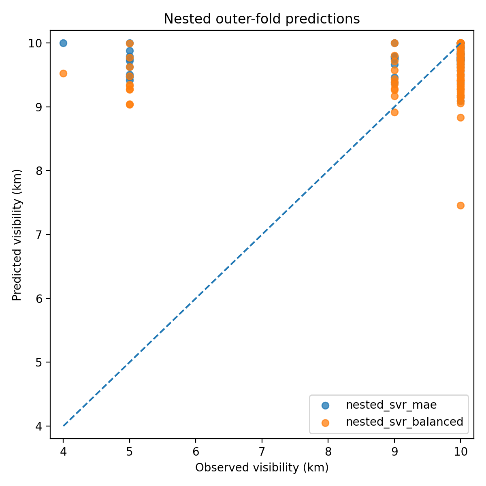
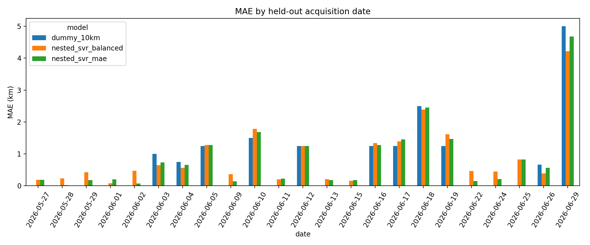

<div align="center">

# PRL Visibility Estimation

### Leakage-controlled atmospheric visibility estimation from fixed-camera imagery and meteorological observations

[](https://github.com/027Sakshi/prl-visibility-estimation)
[](https://www.python.org/)
[](https://github.com/facebookresearch/dinov2)
[](#evaluation-protocol)
[](#testing)
[](#final-locked-results)
[](#research-paper)

**Repository topics:** `atmospheric-visibility` `computer-vision` `dinov2` `transfer-learning` `weather-data` `regression` `nested-cross-validation` `environmental-monitoring` `reproducible-research`

</div>

---

## Overview

This repository contains the complete research pipeline developed for estimating atmospheric visibility at the Physical Research Laboratory using fixed-camera images and meteorological observations. The work combines frozen DINOv2 image representations, weather variables, source-domain experiments using online camera data, transfer and fusion models, grouped validation, uncertainty estimation, and single-image inference.

The final analysis uses **127 PRL images collected across 23 independent acquisition dates**. Because **105 observations are exactly 10 km**, the project reports both conventional sample-weighted regression metrics and reduced-visibility/regime-balanced metrics. Final paper values come exclusively from nested acquisition-date-grouped validation.

> This repository is a research prototype. It is not intended for operational or safety-critical visibility monitoring.

## Research objectives

The project was designed to answer four questions:

1. Can frozen DINOv2 embeddings extract visibility-relevant information from a small, fixed-camera image dataset?
2. Do meteorological variables improve generalization beyond image-only representations?
3. Can source-domain data and transfer weighting improve performance on PRL observations?
4. Can a learned model improve reduced-visibility estimation even when a constant 10 km predictor dominates overall MAE?

## Project workflow



## Data summary

| Component | Description |
|---|---|
| PRL target dataset | 127 fixed-camera images |
| Independent acquisition groups | 23 dates |
| Visibility labels | 4, 5, 9 and 10 km |
| Label distribution | 4 km: 1, 5 km: 10, 9 km: 11, 10 km: 105 |
| Image representation | Frozen DINOv2 ViT-B/14 embeddings |
| Embedding dimension | 768 |
| Meteorological inputs | Temperature, relative humidity, solar intensity and hour |
| External/source work | Online camera imagery, weather preparation and solar-data integration |
| Main task | Visibility regression in kilometres |

Raw PRL imagery, generated embeddings, processed matrices and trained model binaries are intentionally excluded from version control. See [`data/README.md`](data/README.md) and [`models/README.md`](models/README.md) for the expected local layout.

## Methodology

### Image representation

Each PRL image is passed through a frozen DINOv2 ViT-B/14 backbone. The resulting 768-dimensional embeddings are standardized and compressed within the training folds using principal component analysis.

### Weather representation

The fusion experiments use measured weather inputs and engineered variables such as dew point, temperature–dew-point spread, vapour-pressure deficit, cyclic hour encoding and meteorological interaction terms.

### Models evaluated

The repository includes:

- Constant 10 km reference predictor
- Weather-only Ridge regression
- Image PCA–Ridge regression
- Image–weather fusion PCA–Ridge
- Fusion PCA–XGBoost
- Transfer-weighted Ridge reference
- Image and fusion PCA–SVR candidates
- Nested MAE-selected and regime-balanced SVR procedures

A broad 352-candidate PCA–SVR search was used only for development. The final evaluation froze a smaller predeclared 20-candidate grid before nested testing.

## Evaluation protocol

The final protocol prevents images from the same acquisition date from leaking across training and testing:

- **Outer evaluation:** Leave one complete acquisition date out
- **Inner model selection:** Five-fold GroupKFold on the remaining dates
- **Fold-local preprocessing:** Scaling, PCA, feature engineering and model fitting are repeated inside each split
- **Uncertainty:** 5,000 acquisition-date-cluster bootstrap resamples
- **Final reporting:** Combined outer-fold predictions only

The principal metrics are MAE, RMSE and R². Because the dataset is dominated by 10 km observations, the analysis also reports low-visibility MAE, 10 km-label MAE, balanced-regime MAE, date-macro MAE, signed bias and within-threshold rates.

## Final locked results

| Model | MAE (km) | RMSE (km) | R² | Low-visibility MAE (km) | Balanced-regime MAE (km) |
|---|---:|---:|---:|---:|---:|
| Constant 10 km reference | **0.528** | 1.529 | -0.135 | 3.045 | 1.523 |
| Nested SVR selected by MAE | 0.651 | 1.454 | -0.026 | 2.754 | 1.482 |
| Nested balanced SVR | 0.731 | **1.422** | **0.019** | **2.491** | **1.426** |
| Fusion PCA–XGBoost | 0.893 | 1.487 | -0.073 | 2.510 | 1.532 |
| Image PCA–Ridge | 0.949 | 1.530 | -0.137 | 2.480 | 1.554 |
| Weather Ridge | 0.958 | 1.519 | -0.120 | 2.609 | 1.611 |
| Transfer-weighted Ridge | 1.037 | 1.627 | -0.286 | 2.644 | 1.672 |

### Paired comparison with the constant reference

| Comparison | Difference, model minus reference (km) | 95% date-cluster CI | Interpretation |
|---|---:|---:|---|
| MAE-selected SVR, overall MAE | +0.124 | 0.051 to 0.191 | Constant reference remains better overall |
| Balanced SVR, low-visibility MAE | -0.555 | -0.683 to -0.398 | Balanced SVR performs better in reduced visibility |
| Balanced SVR, balanced-regime MAE | -0.096 | -0.170 to -0.012 | Balanced SVR improves equal-regime performance |

The principal conclusion is not that the learned model is universally superior. The constant reference remains strongest on sample-weighted MAE because of the extreme 10 km majority. The image-based balanced SVR, however, provides statistically supported improvements for reduced-visibility conditions and regime-balanced evaluation.

## Result visualizations

<p align="center">
  
</p>

<p align="center">
  
  
</p>

## Repository structure

```text
configs/                         Pipeline configuration
data/                            Local data layout documentation
docs/                            Project status, run guide and archived report
experiments/legacy/              Earlier exploratory experiment entry points
models/                          Model-generation documentation
results/prl/final_nested/        Nested predictions, metrics and bootstrap outputs
results/prl/final_paper/         Locked paper tables, figures and results draft
scripts/run_final_lockin.ps1     Complete final evaluation runner
src/prl/                         Current PRL research pipeline
tests/                           Integration and methodology tests
run_prl_pipeline.py              End-to-end baseline pipeline
requirements-prl.txt             Direct runtime dependencies
requirements-lock.txt            Frozen local environment
```

## Installation

Python 3.11 is recommended.

```powershell
git clone https://github.com/027Sakshi/prl-visibility-estimation.git
cd prl-visibility-estimation

py -3.11 -m venv venv
.\venv\Scripts\Activate.ps1

python -m pip install --upgrade pip
python -m pip install -r requirements-prl.txt
```

## Data setup

Place authorized local data in the paths documented in [`data/README.md`](data/README.md). The main expected artifacts include PRL images, metadata, DINOv2 embeddings and prepared feature matrices.

The project verifies:

- Image/metadata/embedding row alignment
- Required columns and finite values
- Acquisition-date availability
- Label distribution
- Feature dimensions
- Source–target scale mismatches
- Complete out-of-fold prediction coverage

## Running the project

### Full baseline pipeline with fresh image features

```powershell
python run_prl_pipeline.py --extract-features --force-features --require-images
```

### Reuse previously extracted local embeddings

```powershell
python run_prl_pipeline.py
```

### Final nested lock-in

```powershell
powershell -ExecutionPolicy Bypass -File scripts\run_final_lockin.ps1
```

Equivalent manual commands:

```powershell
python -m unittest tests.test_prl_pipeline tests.test_optimized_model tests.test_final_evaluation -v
python src/prl/09_nested_grouped_benchmark.py
python src/prl/10_evaluate_nested_results.py --bootstrap 5000
python src/prl/11_generate_final_paper_results.py
```

## Single-image inference

```powershell
python src/prl/06_predict.py `
  --model models/prl/final_nested_balanced_model.joblib `
  --image data/prl_images/PRL_0001.jpg `
  --temperature 31.1 `
  --humidity 82 `
  --solar 610 `
  --hour 14 `
  --device cpu `
  --output results/prl/predictions/PRL_0001_prediction.json
```

The saved all-data model is an inference artifact. Its training-set performance is not used as final research evidence.

## Testing

```powershell
python -m unittest `
  tests.test_prl_pipeline `
  tests.test_optimized_model `
  tests.test_final_evaluation `
  -v
```

Current status: **7 tests passed**.

## Reproducibility and result policy

Only the values under the following directories are considered final:

```text
results/prl/final_nested/
results/prl/final_paper/
```

The development search under `results/prl/optimization_v2/` must not be reported as final test performance. All final headline values are derived from nested outer-fold predictions and date-cluster uncertainty analysis.

## Research paper

**Status:** In preparation.

The manuscript will report the complete PRL data-collection process, online-source preparation, DINOv2 representation pipeline, transfer/fusion experiments, nested grouped evaluation, uncertainty analysis, final results and limitations.

Until the paper is released, the recommended project reference is:

```bibtex
@misc{sakshi2026prlvisibility,
  author       = {Sakshi},
  title        = {PRL Visibility Estimation: Leakage-Controlled Image and Weather Regression},
  year         = {2026},
  howpublished = {\url{https://github.com/027Sakshi/prl-visibility-estimation}},
  note         = {Research paper in preparation}
}
```

## Limitations

- The target dataset contains only 127 images from one location.
- Only 23 independent acquisition dates are available.
- The target is strongly imbalanced toward exactly 10 km.
- The 4 km label has one observation.
- Weather variables did not consistently improve generalization.
- External/source-domain measurements have scale and domain differences from PRL.
- The positive reduced-visibility result requires confirmation on additional independent low-visibility dates.
- The system must not be used for operational or safety-critical decisions.

## Data and model availability

PRL images and associated restricted metadata are not distributed through this public repository. The code, configurations, aggregate metrics, figures and evaluation outputs are provided so that authorized users can reproduce the analysis after supplying the required local data.

Generated embedding arrays and model binaries are excluded because they are large, machine-generated and potentially tied to restricted source data.

## Author

**[Sakshi Giglani](https://www.linkedin.com/in/sakshi-giglani/)**  

## Acknowledgements

This project was developed as a PRL-oriented atmospheric visibility research study. It uses DINOv2 for frozen visual representation learning and established Python machine-learning tools for dimensionality reduction, regression, grouped validation and uncertainty analysis.

## Disclaimer

This repository documents an experimental research pipeline. Predictions are not calibrated for aviation, transport, public safety or operational meteorological use.
